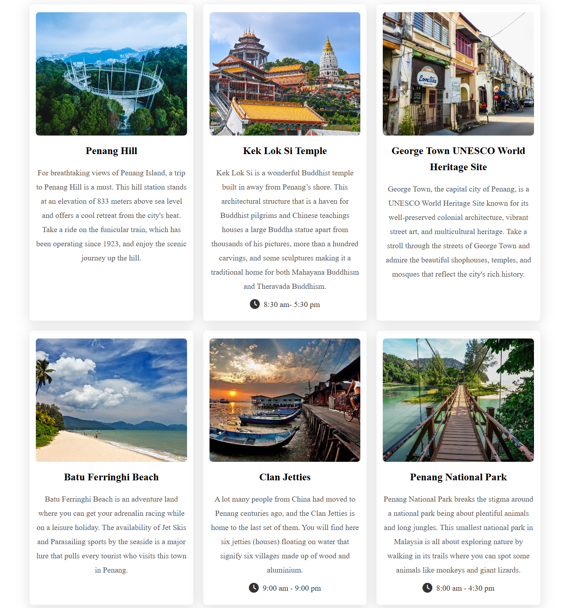

<h1 align="center" style="font-weight: bold;">Penang Paradise 🌴</h1>

<p align="center">
<a href="#technologies">Technologies</a>
<span>&nbsp; • &nbsp;</span>
<a href="#started">Getting Started</a>
<span>&nbsp; • &nbsp;</span>
<a href="#team">Team Members</a>
</p>

<p align="center">A website dedicated to promoting the beauty, culture, and attractions of Penang, Malaysia.</p>

<p align="center">
🌐<a href="https://a2-penang-paradise.vercel.app/" target="_blank" rel="noopener noreferrer">Visit this Project</a>
</p>

<h2 id="layout">🎨 Layout</h2>

<p align="center">


</p>

<h2 id="technologies">💻 Technologies</h2>

- Vite
- React.js
- Tailwind CSS
- JavaScript

### Suggested IDE
- Webstorm
- Visual Studio Code

<h2 id="started">🚀 Getting Started</h2>

Follow these instructions to set up the project locally.

<h3>Prerequisites</h3>

Ensure you have the following installed:

- [NodeJS](https://nodejs.org/)
- [Git](https://git-scm.com/)

<h3>Cloning</h3>

Clone the project repository:

```bash
git clone https://github.com/Some0ne11/A2-PenangParadise.git
```

<h3>Starting</h3>

Navigate to the project directory and start the development server:

```bash
cd A2-PenangParadise
npm install
npm run dev
```

<h2 id="team">🤝 Team Members</h2>

<p>Special thanks to all contributors of this project.</p>
<table>
<tr>

<td align="center">
<a href="https://github.com/Some0ne11">
<br>
<sub>
<b>Muhammad Ammar Danial (22301793)</b>
</sub>
</a>
</td>

<td align="center">
<a href="https://github.com/#">
<br>
<sub>
<b>Ng Xuan Hern (22304061)</b>
</sub>
</a>
</td>

<td align="center">
<a href="https://github.com/#">
<br>
<sub>
<b>Low Yvonne (22305530)</b>
</sub>
</a>
</td>

</tr>
</table>
